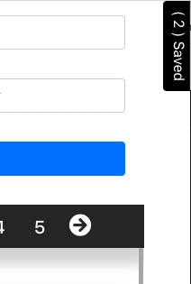

## FullBeaker Pixabay App Project

By [Yosuke Hishinuma](mailto:yosukeonrails@gmail.com)

[yosukeonrails.github.io](https://github.com/yosukeonrails)


## Installations and Instructions

1. Clone or download the file from:

   https://github.com/yosukeonrails/pixabay-proj
   
    or use the Terminal or Command Line:
 
 ```
   $ git clone https://github.com/yosukeonrails/pixabay-proj.git
   ```
2. Navigate to the folder with Terminal or Command Line:

   `$ cd pixabay-proj`

3. Make sure to have the latest version of Node.
 
   For Macs install through terminal with:

   ` $brew install node` 

   or to upgrade node:

   `$brew upgrade node `

   Or for Windows install through the website:
   https://nodejs.org/en/download/

4. Once in the directory, run `npm install` in order to install all the dependencies. 
   
5. Run the program with `npm start`. This will start a server on localhost port 3000 and the application!

   Open your browser of choice and navigate to: http://localhost:3000/ and enjoy!

6. To run tests associated with the project just simply run:

    `npm run test` 
   
   ## Technologies and Dependancies 
    
    * React
    * SASS/CSS
    * ES6
    * react-bootstrap
    * axios
    * jest
    
   ## Bonuses Features
     Besides the implementation of the main requirements, some additional functionalities were added to the application.

   #### Search as type..

    This allows users to search the image they want as they type it in the search bar. In order to keep the app from hitting the webserver for every key pressed, instead it includes a `buffer` of `200` milliseconds which is cancelled whenever the user stops typing and once that buffer threshold is exceeded then the search is executed.

   #### Looks good on mobile!

     In order to adapt the application in to smaller window sizes, besides it being responsive, the saved link list which is positioned on the right side of the UI on the big screen, is instead elegantly hidden and can be toggled with a small tab on the right hand corner!

    

   #### Pagination!

     As another cherry on top, pagination was added so users can see all of the search hits returned. The one on top hides when you scroll down, and there is another one on the bottom as well.

    

